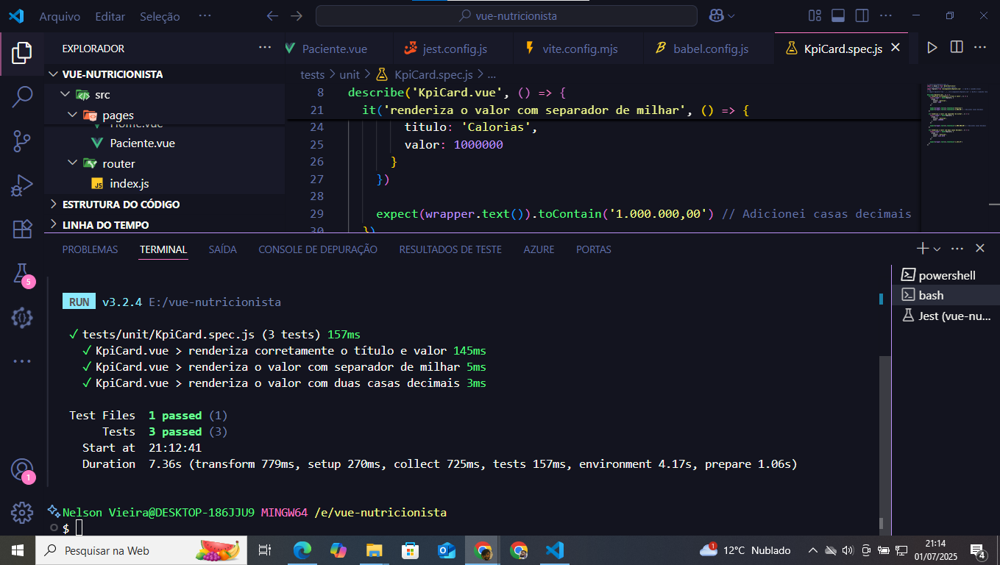

# Projeto Front-End - Plataforma de Nutricionista 🍎

Este projeto foi desenvolvido como parte de um teste técnico para a vaga de Front-End Developer. A aplicação simula uma plataforma de acompanhamento nutricional, permitindo ao nutricionista visualizar pacientes, seus planos alimentares e registrar novos planos.

## 🔧 Tecnologias Utilizadas

- [Vue 3](https://vuejs.org/) com Composition API
- [Vite](https://vitejs.dev/) — para build e dev server
- [Tailwind CSS](https://tailwindcss.com/) — estilização responsiva e tema dark/light
- [Vue Router](https://router.vuejs.org/) — para navegação entre páginas

---

## 📸 Funcionalidades

✅ **Listagem de Pacientes**  
✅ **Detalhamento de paciente com plano alimentar**  
✅ **Filtro por data dos planos**  
✅ **Modal para novo plano alimentar**  
✅ **KPI Cards com indicadores simulados**  
✅ **Tema claro/escuro com alternância**  

---

## 🚀 Rodando o Projeto

1. **Instale as dependências:**

```bash
npm install


# Vue Nutricionista

Interface web para nutricionistas visualizarem, criarem e acompanharem planos alimentares de pacientes.

## ✅ Funcionalidades

- 📋 Listagem de pacientes
- 📈 Detalhes e histórico de planos alimentares com filtro por data
- 📝 Criação e edição de planos via modal
- 📊 KPI Cards dinâmicos atualizados via polling
- 🌗 Tema claro/escuro com persistência em `localStorage`

## 🧪 Qualidade

- ✅ Testes unitários com **Vitest + Vue Test Utils**
- ✅ Cobertura total de testes: **65.4%**
- ✅ ESLint + Prettier configurados
- ✅ Commits atômicos

## 🚀 Como rodar

```bash
npm install
npm run dev


🧪 Como testar
npm test
# ou
npx vitest run --coverage

## 🖼️ Telas do Sistema

Telas de testes:

# Vue Nutricionista

<div align="center">
  
</div>


### Modo Claro vs. Escuro
| Tela Clara | Tela Escura |
|------------|-------------|
|  |  |
|  |  |

### Testes e Cobertura
<div align="center">
  
  
</div>

### Fluxo Completo


