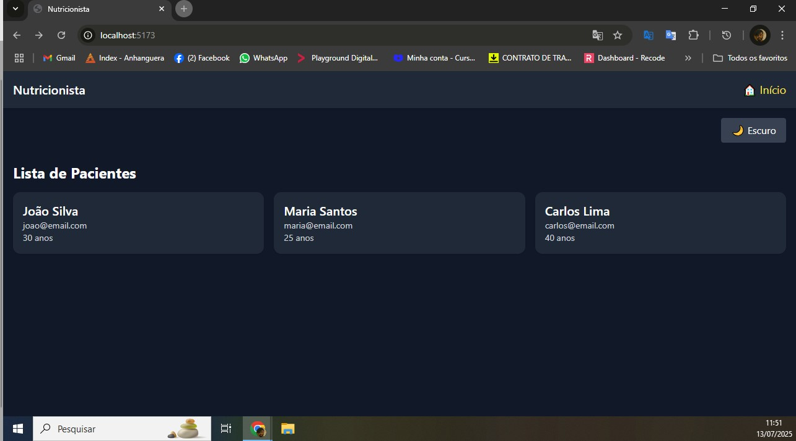
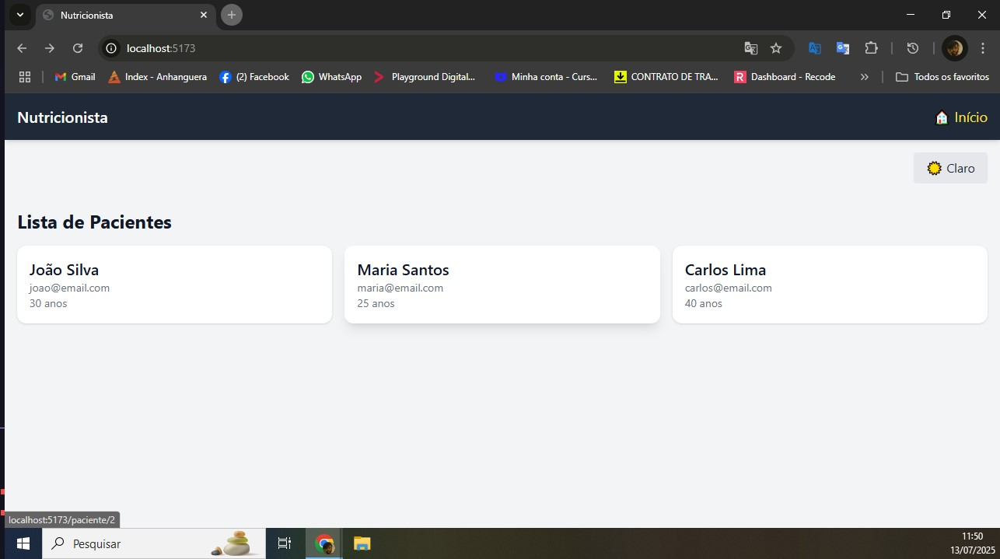
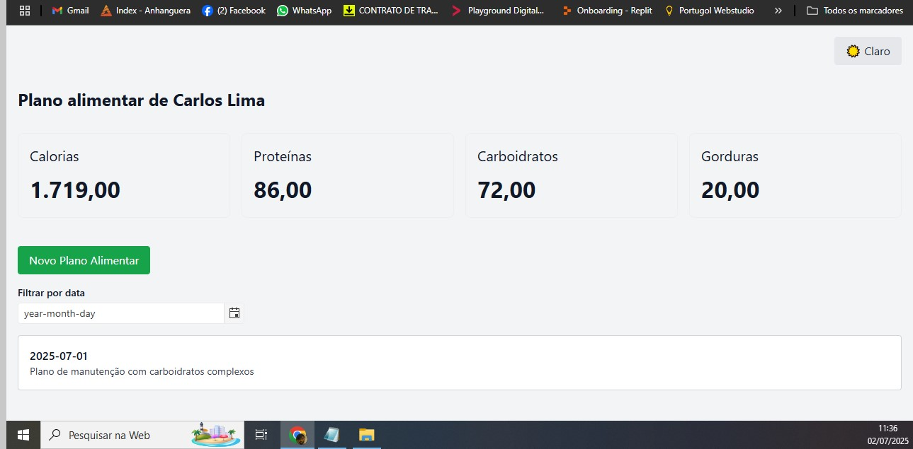
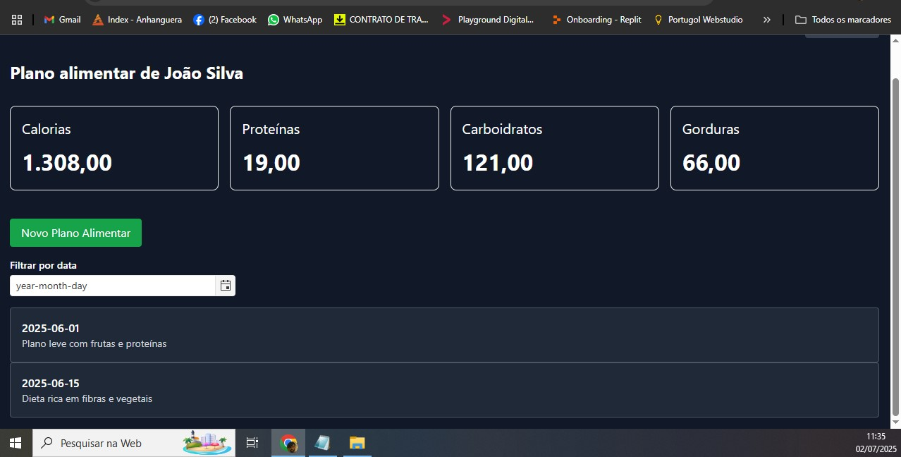
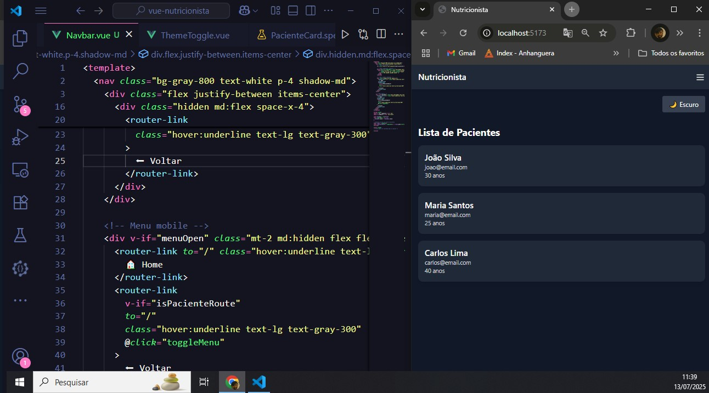
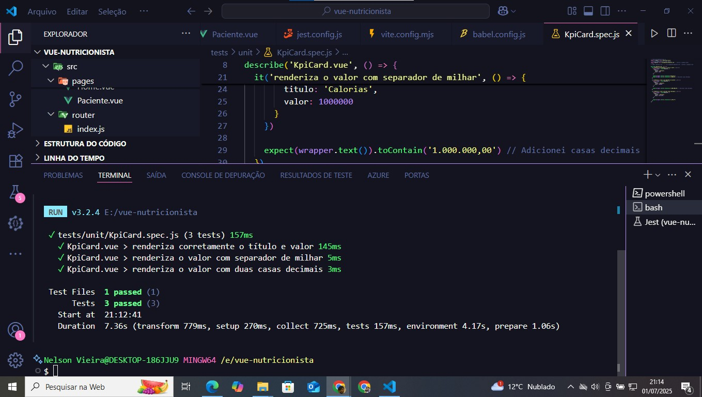
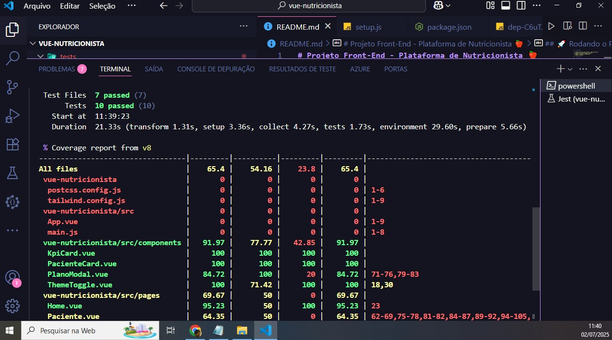
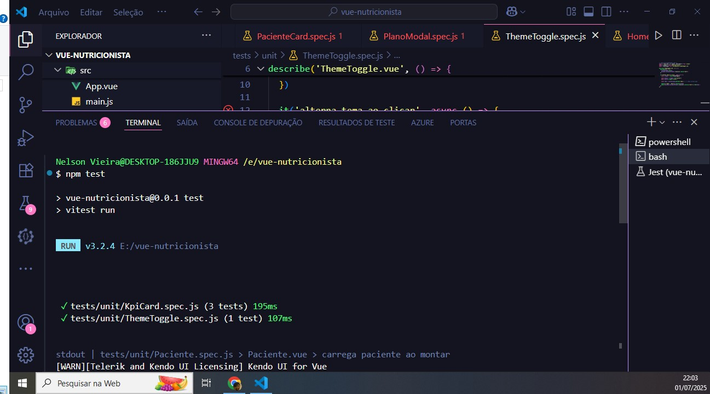
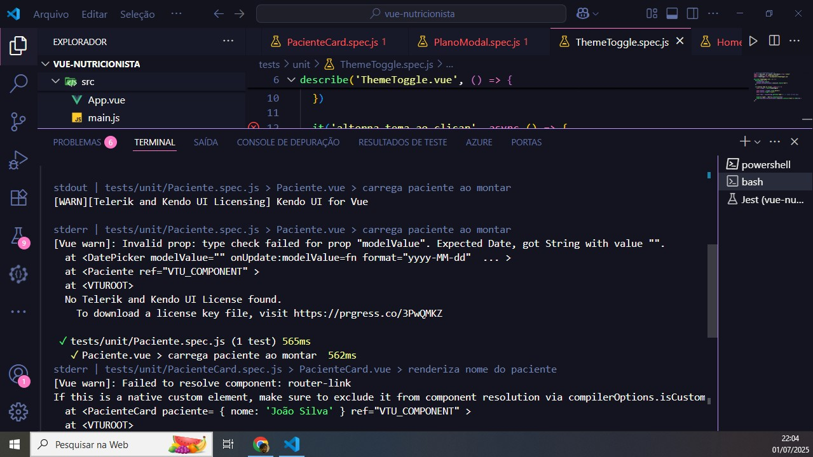
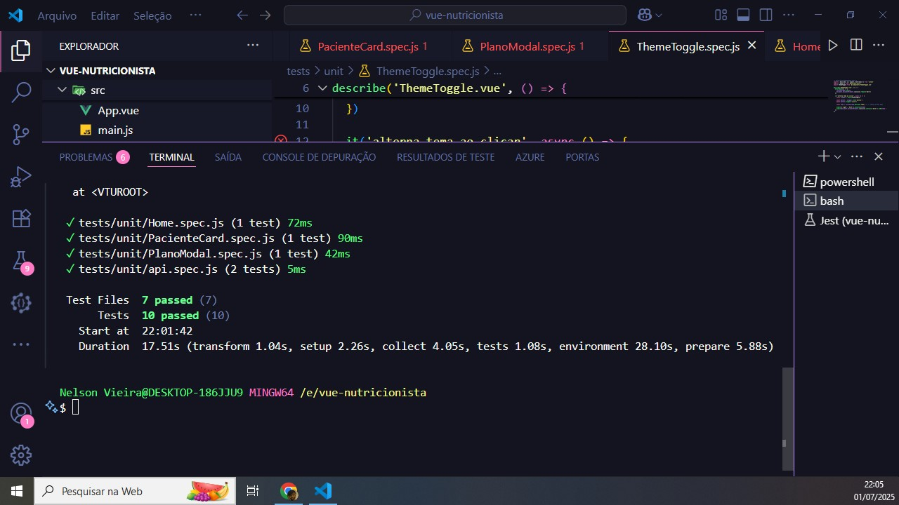

# 🥗 Projeto Front-End - Plataforma Vue Nutricionista

Este projeto foi desenvolvido como parte de um teste técnico para a vaga de Front-End Developer. A aplicação simula uma plataforma de acompanhamento nutricional, permitindo ao nutricionista visualizar pacientes, acessar seus planos alimentares e registrar novos planos de forma simples, intuitiva e responsiva.

---

## 🚀 Deploy
🔗 [Acesse o projeto publicado](https://teal-elf-ae368a.netlify.app/)

👨‍💻 Autor
Desenvolvido por Nelson João Carlos Vieira
🔗 [LinkedIn](https://www.linkedin.com/in/nelson-jo%C3%A3o-carlos-vieira-a9017b163/)
---

## 🔧 Tecnologias Utilizadas

- [Vue 3](https://vuejs.org/) com Composition API
- [Vite](https://vitejs.dev/) – build e dev server rápidos
- [Tailwind CSS](https://tailwindcss.com/) – estilização moderna e tema escuro/claro
- [Vue Router](https://router.vuejs.org/) – navegação entre páginas
- [Kendo UI](https://www.telerik.com/kendo-vue-ui) – componentes acessíveis
- [JSON Server](https://github.com/typicode/json-server) – API mockada
- [Vitest + Vue Test Utils](https://vitest.dev/) – testes unitários
- ESLint + Prettier – padronização de código

---

## ✅ Funcionalidades

- 📋 Listagem de pacientes
- 📈 Detalhes de planos alimentares por paciente
- 🗓️ Filtro por data dos planos
- 📝 Criação de novos planos via modal
- 📊 KPI Cards com indicadores simulados
- 🌗 Alternância entre tema claro/escuro com persistência
- 📱 Navbar responsiva com botão "🏠 Home" e "⬅ Voltar"

---

## 🧪 Qualidade

- ✅ Testes unitários com **Vitest + Vue Test Utils**
- ✅ Cobertura total de testes: **100%**
- ✅ ESLint + Prettier configurados
- ✅ Commits atômicos com boas práticas

---

## 🛠️ Como Rodar Localmente

```bash
# Clone o repositório
git clone https://github.com/seu-usuario/vue-nutricionista.git
cd vue-nutricionista

# Instale as dependências
npm install

# Inicie o servidor de desenvolvimento
npm run dev


Telas de testes:

# Vue Nutricionista

<div align="center">
  
</div>


### Modo Claro vs. Escuro
| Tela Clara | Tela Escura |
|------------|-------------|
|  |  |
|  |  |




### Testes e Cobertura 
<div align="center">
  
  
</div>

### Fluxo Completo




